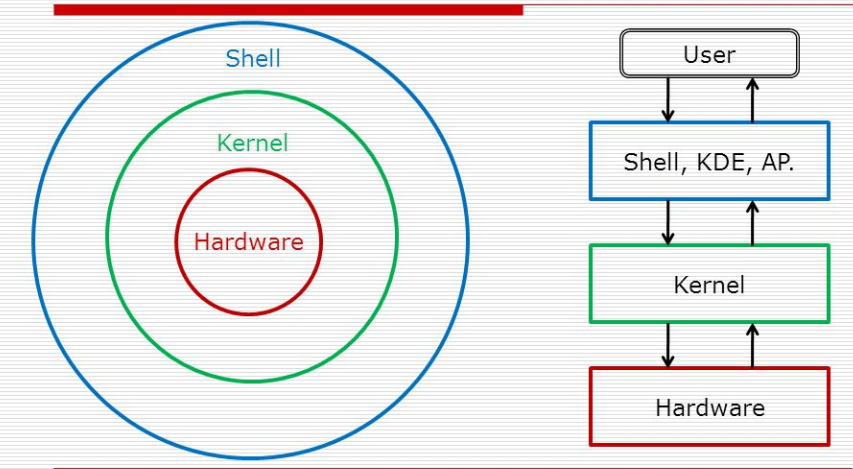

# 쉘과 커널

## 학습 자료

- 생활코딩 - [쉘과 커널 강의](https://opentutorials.org/course/2598/14203)

#### 커널은 뭐지? 

커널 = 운영체제 중  가장 CORE한 부분 - hardware 제어에 관련되어 있다.

#### 쉘은  뭐지?

쉘은 커널을 사람이 기계어로 직접 컨트롤하기 힘드니까! 쉘을 통해 인간의 언어로 쉽게 커널을 컨트롤하기 위해서 만든 프로그램

쉘과 커널은 분리되어있다~! 

그렇기 때문에 서로다른 쉘 프로그램을 이용할 수 있는 것임.(zsh, bash, minishell 등)

#### 쉘 스크립트는 뭐지?

스크립트 = 대본/각본

쉘 스크립트 = 쉘 명령의 대본/각본 

#### [리눅스의 디렉토리 구조](https://opentutorials.org/course/2598/14205) 

