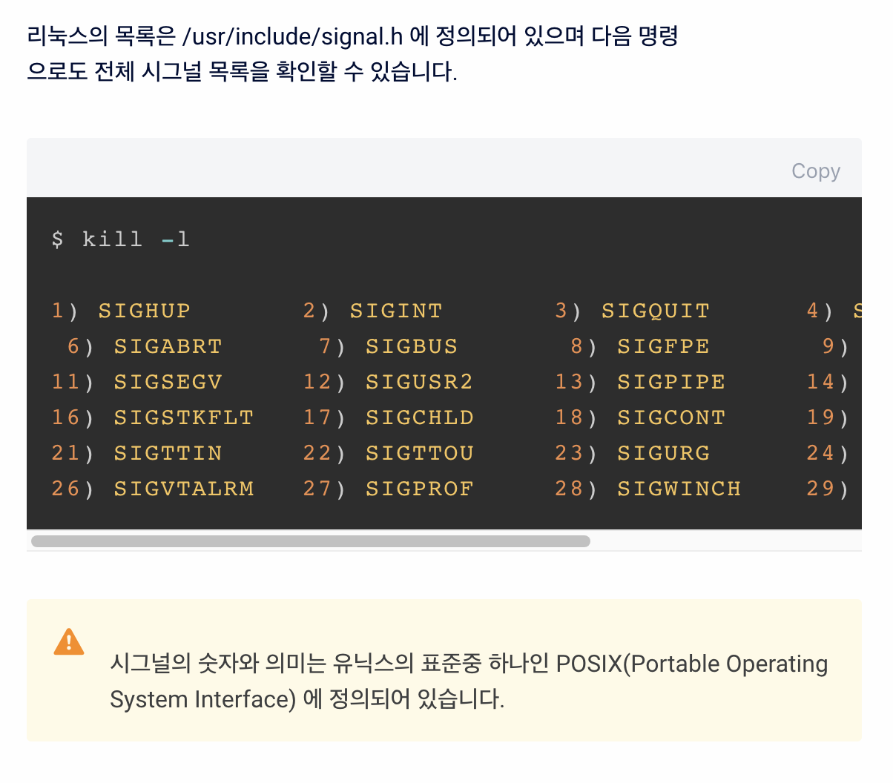

## 학습 자료

- 생활코딩 - [쉘과 커널 강의](https://opentutorials.org/course/2598/14203)
- [Bash 쉘스크립트 개발 시작하기](https://wikidocs.net/111050) 

## 쉘과 커널

#### 커널은 뭐지? 

커널 = 운영체제 중  가장 CORE한 부분 - hardware 제어에 관련되어 있다.

#### 쉘은  뭐지?

쉘은 커널을 사람이 기계어로 직접 컨트롤하기 힘드니까! 쉘을 통해 인간의 언어로 쉽게 커널을 컨트롤하기 위해서 만든 프로그램

쉘과 커널은 분리되어있다~! 

그렇기 때문에 서로다른 쉘 프로그램을 이용할 수 있는 것임.(zsh, bash, minishell 등)

#### 쉘 스크립트는 뭐지?

스크립트 = 대본/각본

쉘 스크립트 = 쉘 명령의 대본/각본 

#### [리눅스의 디렉토리 구조](https://opentutorials.org/course/2598/14205) 

## 프로세스

>  프로세스는 실행중인 프로그램 (할당된 자원들~~ 등등 포함하는 개념) 
>
> **! 중요 프로세스는 항상 부모프로세스가 생성함 !**

- PID(Process ID) : 운영체제에서 프로세스를 식별하기 위해 프로세스에 부여하는 번호
- PPID(Parent process ID) : 프로세스의 부모 프로세스의 PID를 의미한다. 만일 부모 프로세스가 자식 프로세스보다 먼저 종료되는 경우 자식 프로세스는 고아 프로세스가 되어 PPID로 `Init process` 의 PID(1) 를 가지게 된다.
- PGID(Process Group ID) : PG는 1개 이상의 프로세스 묶음을 말한다. PGID는 이러한 프로세스 그룹을 식별하기 위해 부여되는 번호이다.
- SID(Session ID) : 세션은 1개 이상의 프로세스 그룹의 묶음을 의미한다. SID는 이러한 세션을 식별하기 위해 부여되는 번호이다.

### 부모 프로세스와 자식 프로세스의 관계 이해하기

- PID로 부모 프로세스 kill 했을 때, 자식 프로세스는 종료되지 않는다. 

  ` kill [PID]`

- 이러한 문제를 해결하기위해 프로세스 그룹을 만들고, 이 그룹에 ID를 부여함으로서 한번에 프로세스를 종료할 수 있다.

  `kill -- -[PGID]`

- PGID를 통한 kill 명령어 수행 시 부모 프로세스에서 실행된 자식 프로세스를 종료하고 싶지 않다면, 자식 프로세스 실행 전 PGID를 변경하면 된다. Job control 기능을 이용해서 `set -o monitor` 를 먼저 실행 후 프로세스를 실행하면 된다.

[참고 자료](https://leeyh0216.github.io/2020-01-02/sid_pid_ppid_pgid)  

## 리눅스 명령어 파싱

[참고 자료](https://www.leafcats.com/250)

- 명령어는 토큰으로 분리된다.
  - 토큰은 공백이나 탭으로 분리되고 개행문자로 종결된다.
- 첫 단어가 빌트인인지, 디스크에 위치한 실행가능 프로그램인지 검색한다. 빌트인이면 내부적으로 실행하고, 외부 프로그램이면 프로그램의 위치를 검색하기 위해 PATH 변수에 지정된 디렉터리를 검색한다. 

### 명령어 프로세스 순서

> 1. 히스토리 치환
>
> 2. 명령어 토큰 혹은 단어 단위
>
> 3. 히스토리 업데이트
>
> 4. 인용 진행
>
> 5. alias 치환 및 함수 정의
>
> 6. 리다이렉션, 백그라운드, 파이프 설정
>
> 7. 변수 치환(ex. $user, $name ...)
>
> 8. 명령 치환
>
> 9. globbing 이라는 파일명 치환
>
> 10. 명령 실행

### 쉘 명령어 타입

> 1. Alias
>
> 2. 키워드
>
> 3. 함수
>
> 4. 빌트인 내장명령
>
> 5. 실행파일

## 쉘 전역환경 변수

PATH : 실행파일 찾는 경로

`export PATH=$PATH:/path/to/add` 실행파일 PATH 추가.

HOME : home 경로 (init할 때 이 경로를 ~ 과 동기화 시켜주면 될 듯)

SHELL : 현재 사용중인 쉘 경로 저장 (init할 때 이 변수에 minishell 경로 저장해주면  될 듯 )

## 시그널

## 치환 TEST CASE

`echo "\\\$? $HOME ~" ~ \$? $? | cat -e` 